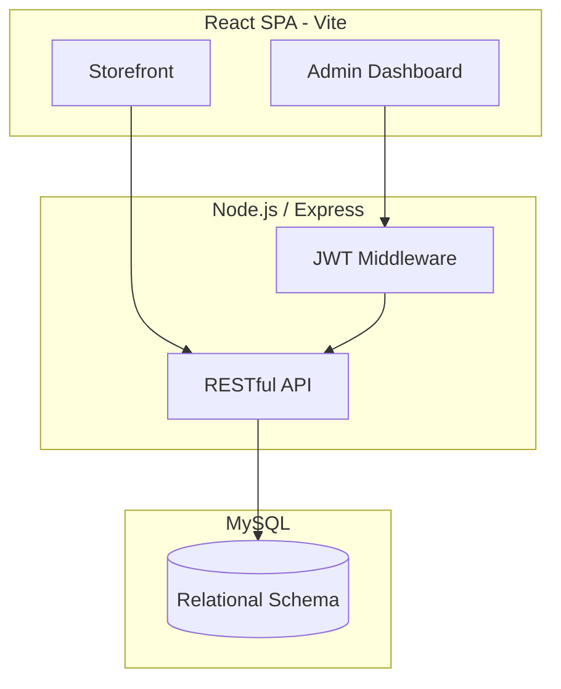

# ShopFlow 🛍️
*A Full-Stack Ecommerce Operations Platform*

ShopFlow is a robust, production-style ecommerce platform designed to simulate a Direct-to-Consumer (DTC) storefront and an extensive internal operations admin panel. It handles the entire lifecycle of an ecommerce business, from browsing products on the storefront to fulfilling orders in the warehouse.

## 🚀 Key Features

* **Dual Interfaces:** Features a customer-facing storefront (catalog, cart, checkout) and an internal Admin panel.
* **Role-Based Access Control (RBAC):** Distinct permissions for Admins, Operations Managers, Customer Service, and Customers.
* **Robust Inventory Management:** Real-time stock tracking at the variant level, preventing overselling.
* **Order Lifecycle & Fulfillment:** Simulated payment processing and comprehensive order state management (Processing -> Packed -> Shipped).
* **Merchandising Engine:** Automated and manual collection rules for product discovery.
* **Analytics Dashboard:** Revenue tracking, Top Products, and Key Performance Indicators (KPIs) like AOV.

## 🏗️ Architecture

## 🛠️ Technology Stack
* **Frontend:** React 19, Vite, React Router, CSS (Vanilla with modern variables/animations), Recharts (for Analytics).
* **Backend:** Node.js, Express.js.
* **Database:** MySQL.
* **Security:** JSON Web Tokens (JWT) for stateless authentication, bcrypt for password hashing.
* **Testing:** Jest + Supertest (Backend API integration tests), Cypress (Frontend E2E tests).

## 🏃 Getting Started

### Prerequisites
- Node.js (v18+)
- MySQL (v8+)

### 1. Database Setup
1. Create a MySQL database named `shopflow`.
2. Run the SQL scripts found in the `database/` folder to create the tables and insert seed data.

### 2. Backend Setup
1. Navigate to the server folder: `cd server`
2. Install dependencies: `npm install`
3. Copy `.env.example` to `.env` and fill in your database credentials and JWT secret.
4. Start the server: `npm run dev`

### 3. Frontend Setup
1. Navigate to the client folder: `cd client`
2. Install dependencies: `npm install`
3. Copy `.env.example` to `.env` (verify the API URL).
4. Start the dev server: `npm run dev`

### Default Admin Credentials
* **Email:** admin@lumoraskin.com
* **Password:** admin

## 🧪 Testing
- **Backend:** Run `npm test` inside the `server` directory.
- **Frontend E2E:** Run `npm run cypress:open` inside the `client` directory.

## 📜 Documentation
Check out the `docs/` folder for deeper architectural insights:
- `architecture.md`: System Design overview.
- `srs.md`: Software Requirements Specification.
- `shopify-mapping.md`: How the system maps to Shopify APIs.
- `social-commerce.md`: TikTok Shop integration strategies.
- `interview-prep.md`: A guide for discussing the engineering decisions of this project.
