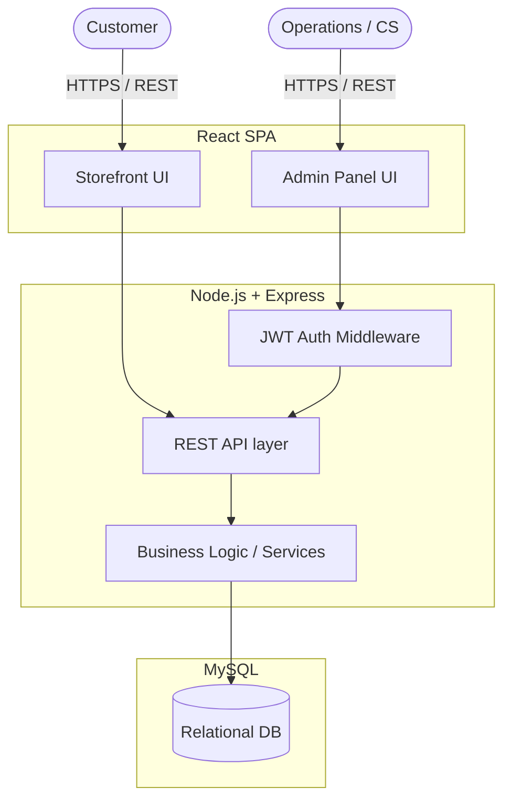

# System Architecture (Phase 2)

## Overview
ShopFlow uses a modern, standard three-tier web application architecture:
1. **Frontend (Client):** A React-based Single Page Application (SPA) providing both the Admin Panel and the Storefront interfaces.
2. **Backend (Server):** A Node.js and Express.js REST API handling all business logic, authentication, and database interactions.
3. **Database:** A MySQL relational database designed to handle structured ecommerce data with complex relationships.

## High-Level Architecture Diagram

## Data Flow Example (Placing an Order)
1. **Customer** adds items to cart and submits checkout on the **Storefront**.
2. **Storefront** sends a `POST /api/orders` request to the **Backend API**.
3. **Backend API** runs validation:
    - Verifies the user.
    - Checks variant prices.
    - Simulates payment.
4. **Backend Logic** calls the **Database**:
    - Reduces stock in `Inventory`.
    - Creates an `Order` record.
    - Creates `Order Items` records.
5. **Backend** returns a success response.
6. **Storefront** shows "Order Confirmation".
7. **Admin Panel** updates to reflect the new order and reduced inventory.

## Technology Stack
- **Frontend:** React, CSS (Vanilla for maximum control or Tailwind if configured), React Router for SPA navigation.
- **Backend:** Node.js, Express.js.
- **Database:** MySQL, accessed via a standard query builder (e.g., Knex) or ORM (e.g., Sequelize/Prisma) for relational integrity.
- **Authentication:** JSON Web Tokens (JWT) for stateless session management.
